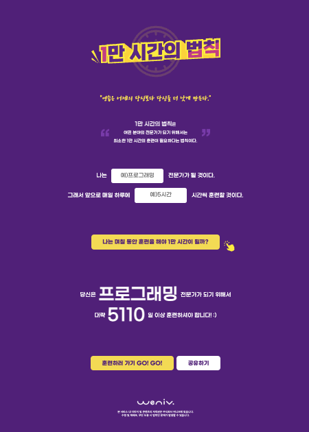

# 1만 시간의 법칙

## 💻 프로젝트 소개

'1만 시간의 법칙'은 어떤 분야의 전문가가 되기 위해 최소 1만 시간의 훈련이 필요하다는 이론에 기반한 웹 애플리케이션입니다. 사용자가 목표를 설정하고 매일 투자할 시간을 입력하면, 전문가가 되기까지 걸리는 시간을 계산하여 보여줍니다. 자기계발에 동기부여를 제공하는 것을 목표로 합니다.

## 🚀 바로가기

[1만 시간의 법칙 계산기](https://kumgold.github.io/oreumi-ten-thousand/index.html)

## 🛠️ 사용 기술

-   HTML
-   CSS

## 📂 폴더 구조

```
root/
├── css/
│   ├── reset.css
│   └── style.css
├── img/
├── index.html
└── README.md
```

## 🏞️ 화면

| 데스크탑                               | 모바일                               |
|------------------------------------|-----------------------------------|
|  |  |

## 👀 목표
- HTML/CSS 기본 문법에 대한 이해
- 반응형 웹에 대한 이해 (데스크탑, 모바일 버전)
- 프로젝트 개발 경험
