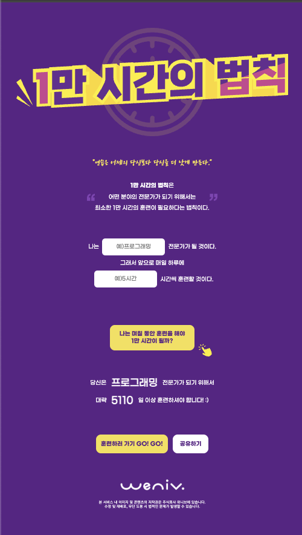

# 1만 시간의 법칙

## 💻 프로젝트 소개

'1만 시간의 법칙'은 어떤 분야의 전문가가 되기 위해 최소 1만 시간의 훈련이 필요하다는 이론에 기반한 웹 애플리케이션입니다. 사용자가 목표를 설정하고 매일 투자할 시간을 입력하면, 전문가가 되기까지 걸리는 시간을 계산하여 보여줍니다. 자기계발에 동기부여를 제공하는 것을 목표로 합니다.

## 🚀 바로가기

[1만 시간의 법칙 계산기](https://kumgold.github.io/oreumi-ten-thousand/index.html)

## 🛠️ 사용 기술

-   HTML
-   CSS

## 📂 폴더 구조

```
root/
├── css/
│   ├── reset.css
│   └── style.css
├── img/
├── index.html
└── README.md
```

## 👀 목표
- <strong>HTML/CSS 기본 문법에 대한 이해</strong> : 페이지 구조에 맞는 시멘틱 태그 사용. (header,section, footer 등)
- <strong>반응형 웹에 대한 이해 (데스크탑, 모바일 버전)</strong> : MediaQuery 브라우저 넓이 768px 기준으로 데스크탑, 모바일 두 가지 버전을 구현
- <strong>웹 접근성, SEO 최적화</strong> : meta 태그와 적절한 대체 텍스트를 제공
- <strong>프로젝트 개발 경험</strong>

## 🏞️ 화면

| 데스크탑 (Width: 768px 이상)             | 모바일 (Width: 767px 이하)             |
|------------------------------------|-----------------------------------|
|  |  |

## 프로젝트를 진행하면서 느낀점
페이지는 간단해 보이지만 피그마와 일치하는 디자인 요소를 적용하는 것에 어려움을 느꼈다. 
여러 컴포넌트를 올바르게 정렬, 배치하는게 특히 어려웠다. 여러 페이지를 만들고 많이 사용해서 익숙해지도록 연습을 해야 할 것 같다.
